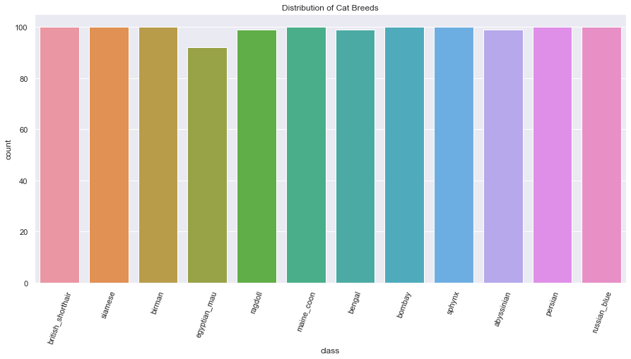
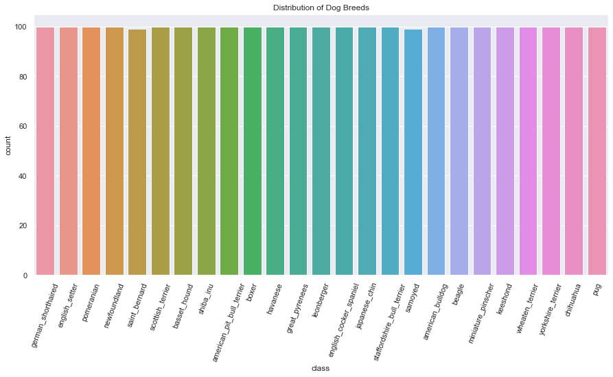
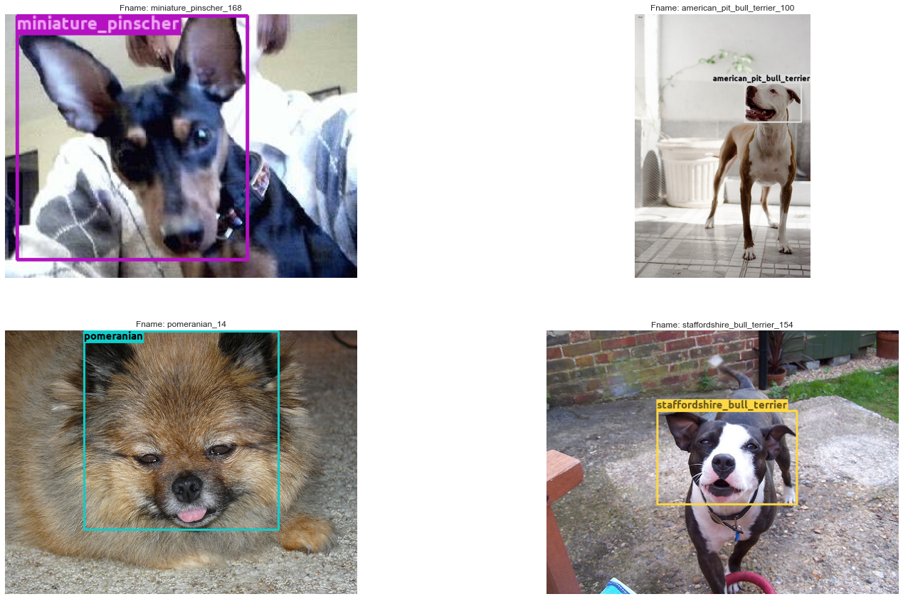
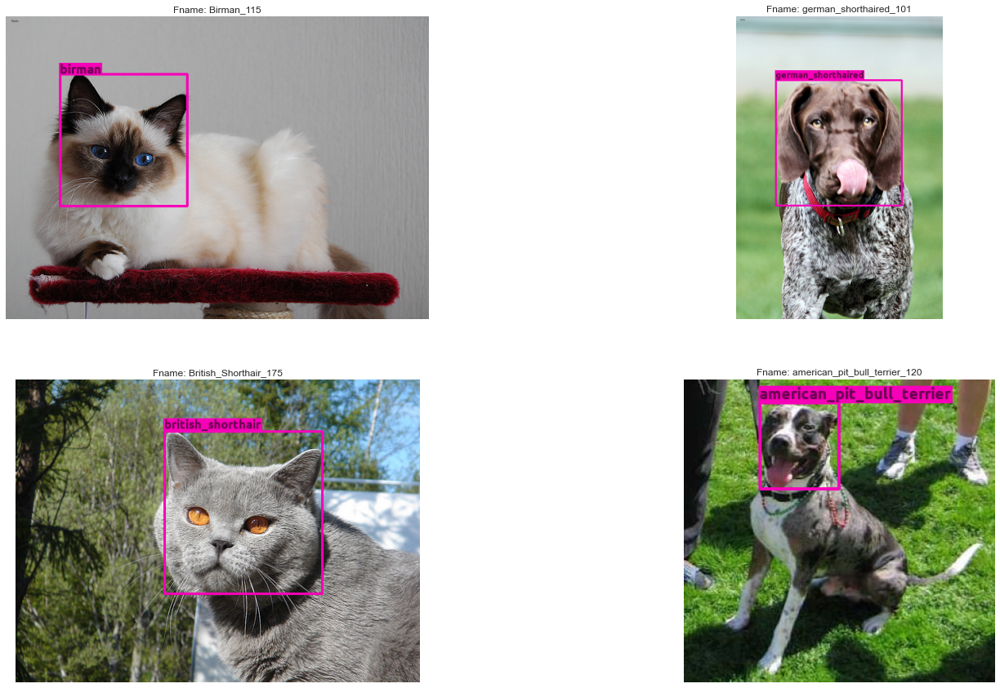
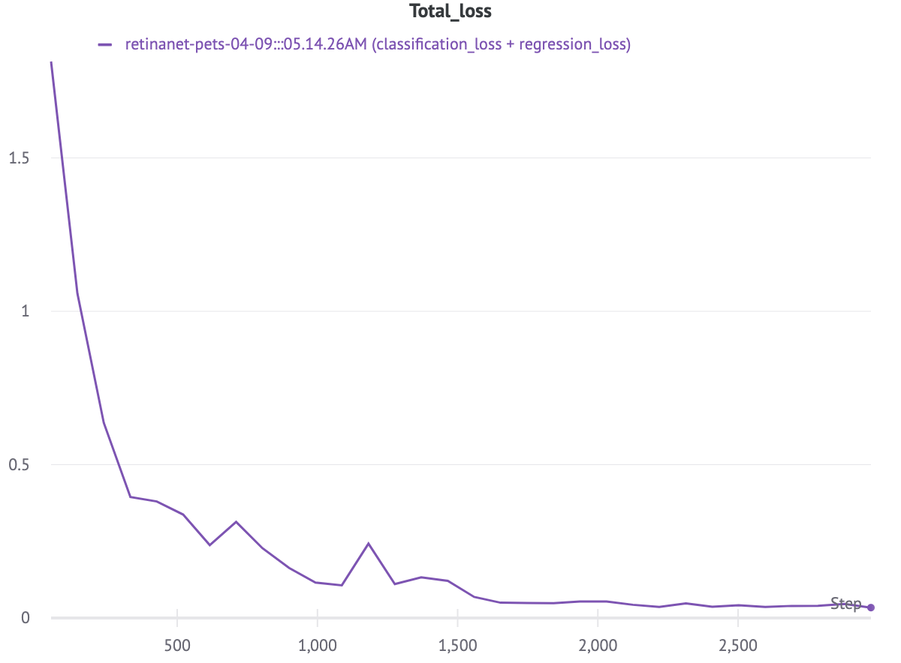
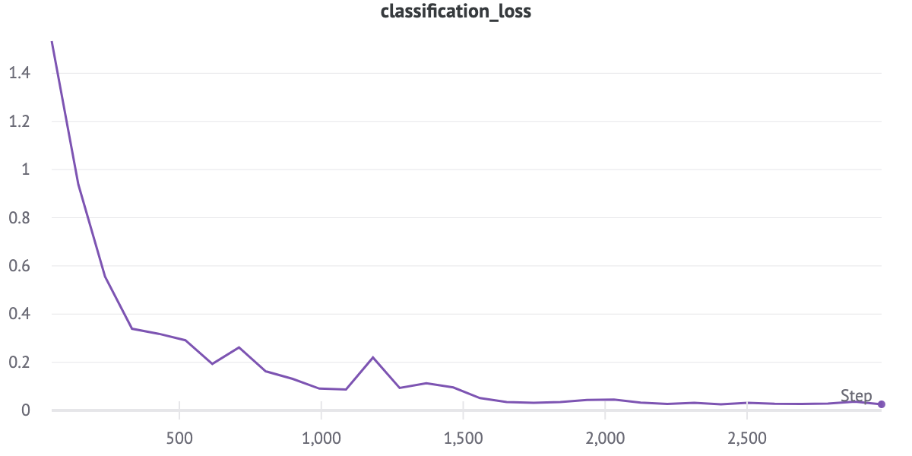
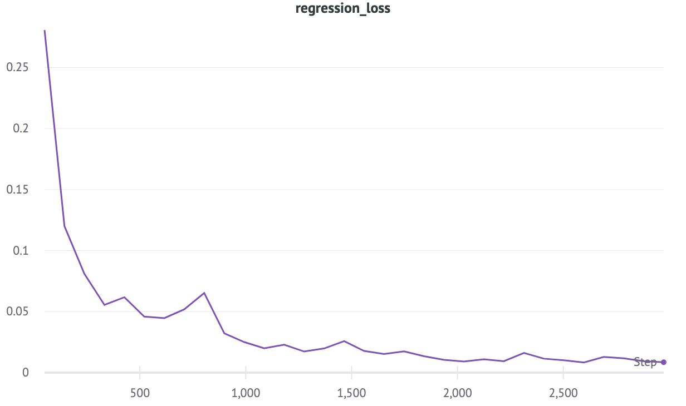
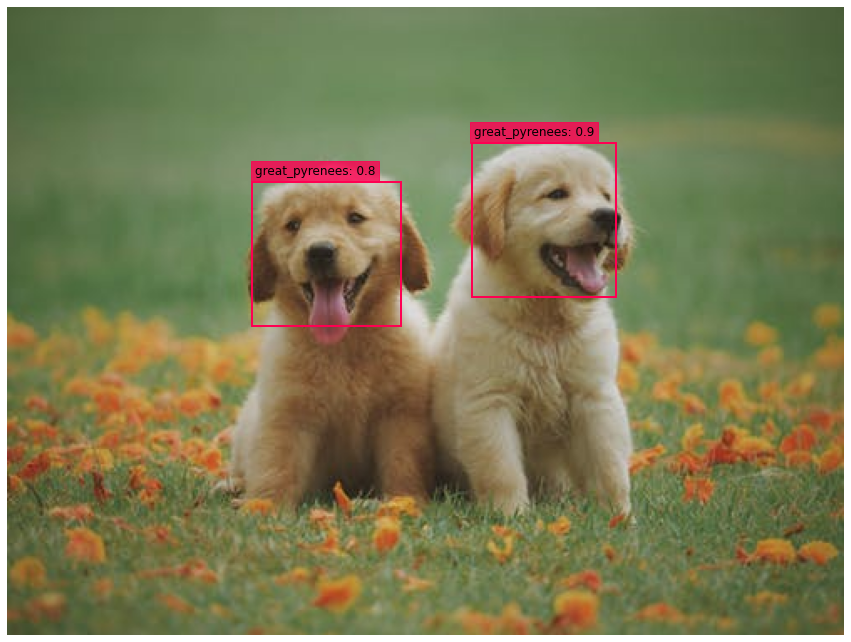
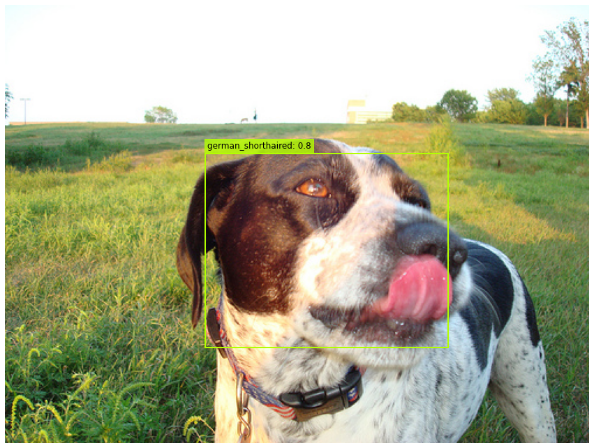
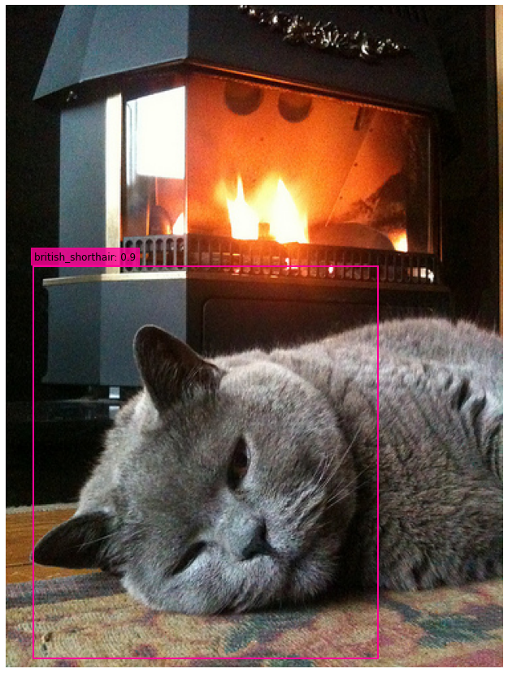

# retinanet_pet_detector
Using a `Retinanet` to detect `cats & dogs`.

Create a `PetDetector` which can detect the `faces` of cats & dogs in Images using my implementation of [Retinanet](https://github.com/benihime91/pytorch_retinanet).

## Dataset used :
`The Oxford-IIIT Pet Dataset` which can be found here [dataset](https://www.robots.ox.ac.uk/~vgg/data/pets/)

## TODO: 
- [x] Parse the data and convert it to a managable format ex: CSV.
- [x] Finsh [Retinanet Project](https://github.com/benihime91/pytorch_retinanet) first.
- [x] Train the Network.
- [ ] Create WebApp using `StreamLit`.

## Train:
- [](https://colab.research.google.com/gist/benihime91/3b25893e4b1cfc40528821cac471a0a1/main.ipynb?authuser=4#scrollTo=WWi2w3N7XPIi) [main.ipynb](nbs/main.ipynb). Train RetinaNet on `The Oxford-IIIT Pet Dataset`.

## Inference on Single Image:
```bash
python inference.py --image "/Users/ayushman/Desktop/Datasets/oxford-iiit-pet/images/great_pyrenees_19.jpg" --fname res_test.png
```
**Flags**:
```bash
python inference.py --help
usage: inference.py [-h] [--url URL] --image IMAGE [--score_thres SCORE_THRES]
                    [--iou_thres IOU_THRES] [--save SAVE] [--show SHOW]
                    [--save_dir SAVE_DIR] [--fname FNAME]

optional arguments:
  -h, --help            show this help message and exit
  --url URL             url to the pretrained weights
  --image IMAGE         path to the input image
  --score_thres SCORE_THRES
                        score_threshold to threshold detections
  --iou_thres IOU_THRES
                        iou_threshold for bounding boxes
  --save SAVE           wether to save the ouput predictions
  --show SHOW           wether to display the output predicitons
  --save_dir SAVE_DIR   directory where to save the output predictions
  --fname FNAME         name of the output prediction file
```

## Exploratory Data Analysis:

  

>**Example images from the Dataset:**  




## Results:
- **COCO API results on hold-out test dataset:**
```bash
IoU metric: bbox
 Average Precision  (AP) @[ IoU=0.50:0.95 | area=   all | maxDets=100 ] = 0.594
 Average Precision  (AP) @[ IoU=0.50      | area=   all | maxDets=100 ] = 0.919
 Average Precision  (AP) @[ IoU=0.75      | area=   all | maxDets=100 ] = 0.584
 Average Precision  (AP) @[ IoU=0.50:0.95 | area= small | maxDets=100 ] = -1.000
 Average Precision  (AP) @[ IoU=0.50:0.95 | area=medium | maxDets=100 ] = 0.800
 Average Precision  (AP) @[ IoU=0.50:0.95 | area= large | maxDets=100 ] = 0.586
 Average Recall     (AR) @[ IoU=0.50:0.95 | area=   all | maxDets=  1 ] = 0.612
 Average Recall     (AR) @[ IoU=0.50:0.95 | area=   all | maxDets= 10 ] = 0.654
 Average Recall     (AR) @[ IoU=0.50:0.95 | area=   all | maxDets=100 ] = 0.654
 Average Recall     (AR) @[ IoU=0.50:0.95 | area= small | maxDets=100 ] = -1.000
 Average Recall     (AR) @[ IoU=0.50:0.95 | area=medium | maxDets=100 ] = 0.800
 Average Recall     (AR) @[ IoU=0.50:0.95 | area= large | maxDets=100 ] = 0.642
```
- **Training Logs:**

  
  
  
  
  
- **Results:**
 
  
  
  
