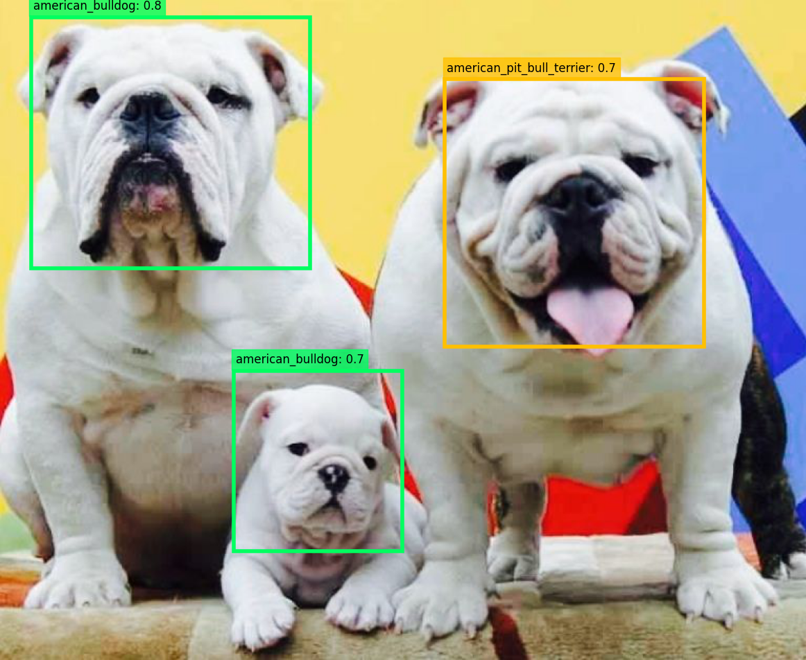

[](https://share.streamlit.io/benihime91/retinanet_pet_detector/app.py)

<div align="center">

# Pet Face Detector 👁 🐶 🐱
**Using a [RetinaNet](https://github.com/benihime91/pytorch_retinanet) to detect faces of common breeds of Pets.**

Go to this [link](https://share.streamlit.io/benihime91/retinanet_pet_detector/app.py) to preview the web app !


<p align="center"> </p> 
<b>The model not only detects faces of the pets but also classifies the face breed of the animal.</b>
</div>

The model has been trained on the these following breeds :  

<p align="center"> </p>  

**This project is built on top of :** 
<div align="center">
  <p align="center"> </p>
  
  **[PyTorch](https://github.com/pytorch/pytorch)**  
  
  <p align="center"> </p>
  
  **[PyTorchLightning](https://github.com/PyTorchLightning/pytorch-lightning)** 
  
  **[Torchvision](https://github.com/pytorch/vision)**
  
  **[Albumentations](https://github.com/albumentations-team/albumentations)**
  
  **[Streamlit](https://github.com/streamlit/streamlit)**

</div>

## **Dataset used**:

For training the models **The Oxford-IIIT Pet Dataset** has been used which can be found [here](https://www.robots.ox.ac.uk/~vgg/data/pets/). Two pretrained models for detections are availabel : (RetinaNet with resnet50 backbone) and (RetinaNet with resnet34 backbone). These pretraned-models can be selected via the .ymal files present in the `config/` dir. 

## TODO:

- [x] Parse the data and convert it to a managable format ex: CSV.
- [x] Finish [Retinanet Project](https://github.com/benihime91/pytorch_retinanet) first.
- [x] Train the Network.
- [x] Create WebApp using `StreamLit`.
- [x] Notebooks & Scripts for Train. 
- [x] Deploy WebApp . Link to the app : https://share.streamlit.io/benihime91/retinanet_pet_detector/app.py

## Tutorials
- **Google Colab Notebook** with free GPU: <a href="https://colab.research.google.com/github/benihime91/retinanet_pet_detector/blob/master/demo.ipynb"></a>
- **Kaggle Notebook** with free GPU: [https://www.kaggle.com/benihime91/demo-nb](https://www.kaggle.com/benihime91/demo-nb)
  
## Usage:

- Install [python3](https://www.python.org/downloads/)
- Install dependencies
  ```bash
  $ git clone --recurse-submodules -j8 https://github.com/benihime91/retinanet_pet_detector.git
  $ cd retinanet_pet_detector
  $ pip install -r requirements.txt
  ```
- Run app
  ```bash
  $ streamlit run app.py
  ```
## Requirements

Python 3.8 or later with all [requirements.txt](https://github.com/ultralytics/yolov5/blob/master/requirements.txt) dependencies installed, including `torch>=1.6`. To install run:
  ```bash
  $ pip install -r requirements.txt
  ```
  
## Inference with Pre-Trained weights:
  ```bash
  $ python inference.py \
        --config "config/resnet34.yaml"\
        --image "/content/oxford-iiit-pet/images/german_shorthaired_128.jpg" \
        --save_dir "/content/" \
        --fname "res_1.png" \
  ```
  or 

  ```bash
  $ python inference.py \
        --config "config/resnet50.yaml"\
        --image "/content/oxford-iiit-pet/images/german_shorthaired_128.jpg" \
        --save_dir "/content/" \
        --fname "res_1.png" \
  ```

**Flags**:

```bash
 $ python inference.py --help
    usage: inference.py [-h] [--config CONFIG] --image IMAGE
                    [--score_thres SCORE_THRES] [--iou_thres IOU_THRES]
                    [--md MD] [--save SAVE] [--show SHOW]
                    [--save_dir SAVE_DIR] [--fname FNAME]

    optional arguments:
      -h, --help            show this help message and exit
      --config CONFIG       path to the config file
      --image IMAGE         path to the input image
      --score_thres SCORE_THRES
                            score_threshold to threshold detections
      --iou_thres IOU_THRES
                            iou_threshold for bounding boxes
      --md MD               max detections in the image
      --save SAVE           wether to save the ouput predictions
      --show SHOW           wether to display the output predicitons
      --save_dir SAVE_DIR   directory where to save the output predictions
      --fname FNAME         name of the output prediction file

```


## Training Procedure:
- Clone the Repo:
  ```bash
  $ git clone --recurse-submodules -j8 https://github.com/benihime91/retinanet_pet_detector.git
  $ cd retinanet_pet_detector
  ```
- Ensure all requirements are installed. To train on GPU need to install PyTroch GPU build. Download it from [here](https://pytorch.org/). Then commment the first 2 lines from `requirements.txt`. After that 
  ```bash
  $ pip install -r requirements.txt
  ```
- Download the dataset from [here](https://www.robots.ox.ac.uk/~vgg/data/pets/).
- After downloading the dataset . Run the `references/data_utils.py` to convert the xml annotations into csv file and also create train, validation and test splits.
  
  ```bash
  $ python prep_data.py --help
    usage: prep_data.py [-h] [--action {create,split}] [--img_dir IMG_DIR]
                       [--annot_dir ANNOT_DIR] [--labels LABELS] [--csv CSV]
                       [--valid_size VALID_SIZE] [--test_size TEST_SIZE]
                       [--output_dir OUTPUT_DIR] [--seed SEED]

    optional arguments:
      -h, --help            show this help message and exit
      --action {create,split}
      --img_dir IMG_DIR     path to the image directory
      --annot_dir ANNOT_DIR
                            path to the annotation directory
      --labels LABELS       path to the label dictionary
      --csv CSV             path to the csv file
      --valid_size VALID_SIZE
                            size of the validation set relative to the train set
      --test_size TEST_SIZE
                            size of the test set relative to the validation set
      --output_dir OUTPUT_DIR
                            path to the output csv file
      --seed SEED           random seed
  ```

  This commmand converts the xml to csv files. Change the `--img_dir` to the path where the dataset images are stored, `--annot_dir` to the path where the xml annotation are stored & `--labels` to where the `label.names` file is stored. `label.names` is stored in `data/labels.names`. The csv file will be saved in `--output_dir` as `data-full.csv`.
  
  ```bash
  $ python prep_data.py.py \
      --action create \
      --img_dir "/content/oxford-iiit-pet/images" \
      --annot_dir "/content/oxford-iiit-pet/annotations/xmls" \
      --labels "/content/retinanet_pet_detector/data/labels.names" \
      --output_dir "/content/retinanet_pet_detector/data/"
  ```

  Run this command to convert training, valiation and test splits.  
  The datasets will be saved in `--output_dir` as  `train.csv`,`valid.csv` and `test.csv`.  
  Set the `--csv` argument to the path to `data-full.csv` generated above.  
  You can also set a seed by passing in the `--seed` argument to insure that results reproducibility.

  ```bash
  $ python prep_data.py.py \
      --action split \
      --csv "/content/retinanet_pet_detector/data/data-full.csv"\
      --valid_size 0.3 \
      --test_size 0.5 \
      --output_dir "/content/retinanet_pet_detector/data/"
      --seed 123
  ```

- Training is controlled by the `main.yaml` file. Before training ensures that the paths in `main.yaml` : ( `hparams.train_csv`,`hparams.valid_csv`,`hparams.valid_csv` ) are the correct paths to the files generated above.  
  If `not training` on GPU change these arguments:  
  - `trainer.gpus` = 0
  - `trainer.precision` = 32
  
  In the same the other flags in `main.yaml` can be modified.

- To train run this command. The `--config` argument points to the path to where the `main.yaml` file is saved.
  ```bash
  $ python train.py \
     --config "/content/retinanet_pet_detector/config/main.yaml" \
     --verbose 0 \
  ```
  Model weights are automatically saved as `state_dicts()` in the `filepath` specifed in `trainer.model_checkpoint.params.filepath` in `main.yaml` as `weights.pth`

- For inference modify the `config/34.yaml` or `config/resnet50.yaml` file . Set the `url` to be the path where the weights are saved. Example: `checkpoints/weights.pth`.

  * `--config` : corresponds to the path where the `config/resnet34.yaml` or `config/resnet50.yaml` file is saved.
  * `--image`  : corresponds to the path of the `image`. 
  * Results are saved as `{save_dir}/{fname}`.
  
  ```bash
  $ python inference.py \
      --config "/content/retinanet_pet_detector/config/resnet50.yaml"\
      --image "/content/oxford-iiit-pet/images/german_shorthaired_128.jpg"\
      --score_thres 0.7 \
      --iou_thres 0.4 \
      --save_dir "/content/" \
      --fname "res_1.png" \
  ```
  or 
  
  ```bash
  $ python inference.py \
        --config "/content/retinanet_pet_detector/config/resnet34.yaml" \
        --image "/content/oxford-iiit-pet/images/german_shorthaired_128.jpg" \
        --save_dir "/content/" \
        --fname "res_1.png" \
  ```

- To view tensorboard logs:

  ```bash
  $ tensorboard --logdir "logs/"
  ```
  
## Results:

- Results for RetinaNet model with resnet34 backbone:  

  ```bash
  [09/19 13:37:58 references.lightning]: Evaluation results for bbox: 
  IoU metric: bbox
   Average Precision  (AP) @[ IoU=0.50:0.95 | area=   all | maxDets=100 ] = 0.576
   Average Precision  (AP) @[ IoU=0.50      | area=   all | maxDets=100 ] = 1.000
   Average Precision  (AP) @[ IoU=0.75      | area=   all | maxDets=100 ] = 0.608
   Average Precision  (AP) @[ IoU=0.50:0.95 | area= small | maxDets=100 ] = -1.000
   Average Precision  (AP) @[ IoU=0.50:0.95 | area=medium | maxDets=100 ] = 0.500
   Average Precision  (AP) @[ IoU=0.50:0.95 | area= large | maxDets=100 ] = 0.576
   Average Recall     (AR) @[ IoU=0.50:0.95 | area=   all | maxDets=  1 ] = 0.544
   Average Recall     (AR) @[ IoU=0.50:0.95 | area=   all | maxDets= 10 ] = 0.624
   Average Recall     (AR) @[ IoU=0.50:0.95 | area=   all | maxDets=100 ] = 0.624
   Average Recall     (AR) @[ IoU=0.50:0.95 | area= small | maxDets=100 ] = -1.000
   Average Recall     (AR) @[ IoU=0.50:0.95 | area=medium | maxDets=100 ] = 0.500
   Average Recall     (AR) @[ IoU=0.50:0.95 | area= large | maxDets=100 ] = 0.628
  ```
  
- Results for RetinaNet model with resnet50 backbone:  

   ```bash
   [09/20 12:39:13 references.lightning]: Evaluation results for bbox: 
   IoU metric: bbox
    Average Precision  (AP) @[ IoU=0.50:0.95 | area=   all | maxDets=100 ] = 0.600
    Average Precision  (AP) @[ IoU=0.50      | area=   all | maxDets=100 ] = 0.979
    Average Precision  (AP) @[ IoU=0.75      | area=   all | maxDets=100 ] = 0.604
    Average Precision  (AP) @[ IoU=0.50:0.95 | area= small | maxDets=100 ] = -1.000
    Average Precision  (AP) @[ IoU=0.50:0.95 | area=medium | maxDets=100 ] = -1.000
    Average Precision  (AP) @[ IoU=0.50:0.95 | area= large | maxDets=100 ] = 0.600
    Average Recall     (AR) @[ IoU=0.50:0.95 | area=   all | maxDets=  1 ] = 0.606
    Average Recall     (AR) @[ IoU=0.50:0.95 | area=   all | maxDets= 10 ] = 0.619
    Average Recall     (AR) @[ IoU=0.50:0.95 | area=   all | maxDets=100 ] = 0.619
    Average Recall     (AR) @[ IoU=0.50:0.95 | area= small | maxDets=100 ] = -1.000
    Average Recall     (AR) @[ IoU=0.50:0.95 | area=medium | maxDets=100 ] = -1.000
    Average Recall     (AR) @[ IoU=0.50:0.95 | area= large | maxDets=100 ] = 0.619
   ```
